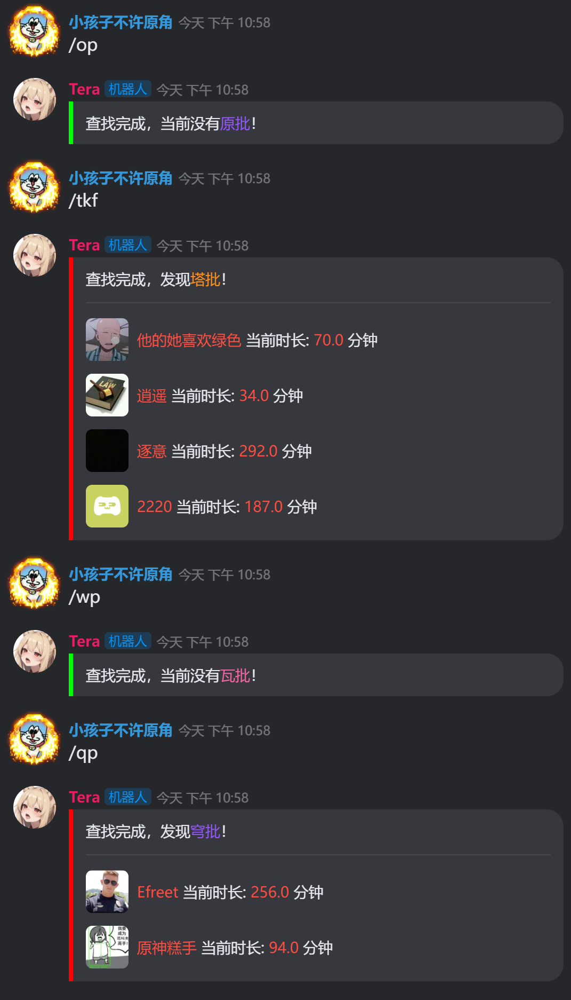

<div align="center">

# nonebot-plugin-morep-finder

_✨ Extend from [op finder](https://github.com/ninthseason/nonebot-plugin-morep-finder) ✨_

<a href="./LICENSE">
    
</a>
<a href="https://pypi.python.org/pypi/nonebot-plugin-morep-finder">
    
</a>


</div>

## 📖 介绍

显示服务器中当前正在玩指定游戏的玩家，效果图见下文。

## 💿 安装

<details open>
<summary>使用 nb-cli 安装</summary>
在 nonebot2 项目的根目录下打开命令行, 输入以下指令即可安装

    nb plugin install nonebot-plugin-morep-finder

</details>

<details>
<summary>使用包管理器安装</summary>
在 nonebot2 项目的插件目录下, 打开命令行, 根据你使用的包管理器, 输入相应的安装命令

<details>
<summary>pip</summary>

    pip install nonebot-plugin-morep-finder
</details>
<details>
<summary>pdm</summary>

    pdm add nonebot-plugin-morep-finder
</details>
<details>
<summary>poetry</summary>

    poetry add nonebot-plugin-morep-finder
</details>
<details>
<summary>conda</summary>

    conda install nonebot-plugin-morep-finder
</details>

打开 nonebot2 项目根目录下的 `pyproject.toml` 文件, 在 `[tool.nonebot]` 部分追加写入

    plugins = ["nonebot_plugin_morep_finder"]

</details>

## ⚙️ 配置

kaiheila adaptor 相关配置请见[kaiheila adaptor 使用指南](https://github.com/Tian-que/nonebot-adapter-kaiheila/blob/master/MANUAL.md)

本插件需要在 nonebot2 项目的`.env`文件中添加下表中的配置

|      配置项      | 必填 | 默认值 |        说明         |
|:-------------:|:----:|:---:|:-----------------:|
| kook_auth_key | 是 |  无  | 自己账号的kook鉴权cookie |
| morep_config  | 是 | [] |    插件配置（详见下文）     |

1. kook_auth_key

   因为目前KOOK v3 api中没有获得玩家在玩状态的接口，本插件通过v2 api获取玩家在玩状态。
   
   由于v2 api不受官方支持，需要手动抓包获取一个账号的鉴权cookie，用以调用api。

   1. 登录网页版KOOK，随便进入一个服务器，打开浏览器控制台
   2. 控制台切换到Network(网络)选项卡
   3. KOOK中随意点击一个用户的头像，打开资料面板
   4. 此时Network选项卡中应会抓到若干请求，随意选择一个v2api的请求查看，如 `https://www.kookapp.cn/api/v2/users/<用户id>?guild_id=<服务器id>`
   5. 查看请求的Headers选项卡中的Request Headers(请求头)，找到Cookie键，形如
   
      ```
      Cookie: auth=<kook_auth_key>; PHPSESSID=<something>; _csrf_chuanyu=<something>
      ```

   6. 其中<kook_auth_key>即为我们需要的配置项

   > **此实在是不得已而为之的下策，若v3 api有获取在玩状态的方法，或更方便获取v2 api auth key的方法，敬请告知。**

2. morep_config
   
   一个**元素为字典**的**列表**，字典格式为:
   ```json
   {
        "name": "对此类玩家的称呼",
        "color": "称呼颜色",
        "game": ["游戏名称1", "游戏名称2", ...],
        "command": ["触发指令1", "触发指令2", ...]
   }
   ```
   
   例如下面的字典:
   ```json
   {
        "name": "塔批",
        "color": "warning",
        "game": ["逃离塔科夫", "逃离唐科夫", "进入孤儿院", "逃离提瓦特大陆"],
        "command": ["tkf", "tp", "寻找塔批"]
   }
   ```
   机器人在收到`tkf | tp | 寻找塔批`指令时，会列出服务器中所有在玩状态为`"逃离塔科夫" | "逃离唐科夫" | "进入孤儿院" | "逃离提瓦特大陆"`的玩家。
3. color目前已知的可选值为primary, success, danger, warning, info, secondary, body, tips, pink, purple

一个morep_config示例：
```python
morep_config = [{"name": "原批","color": "purple","game": ["原神"],"command": ["op", "寻找原批", "查找原批", "原批"]},{"name": "塔批","color": "warning","game": ["逃离塔科夫", "逃离唐科夫", "进入孤儿院", "逃离提瓦特大陆"],"command": ["tkf", "tp", "寻找塔批", "查找塔批", "塔批"]},{"name": "瓦批","color": "pink","game": ["瓦洛兰特", "无畏契约"],"command": ["wp", "瓦批", "瓦洛兰特", "无畏契约"]}, {"name": "穹批", "color": "purple", "game": ["崩坏：星穹铁道", "崩坏: 星穹铁道", "星穹铁道"], "command": ["qp", "穹批", "寻找穹批", "查找穹批"]}]
```
> 注意：为保证正常解析，请将morep_config保持在一行内，不要换行
## 🎉 使用
### 指令表
|         指令         | 权限 | 需要@ | 范围 | 说明 |
|:------------------:|:----:|:----:|:----:|:----:|
| 在morep_config中指定 | 所有人 | 否 | 群聊 | 触发插件 |


### 效果图

